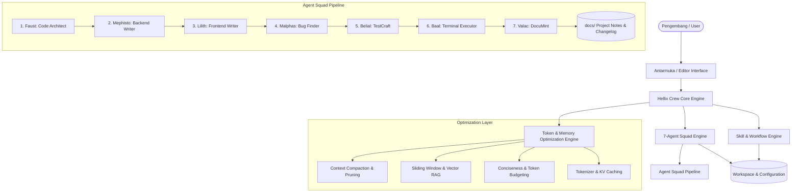
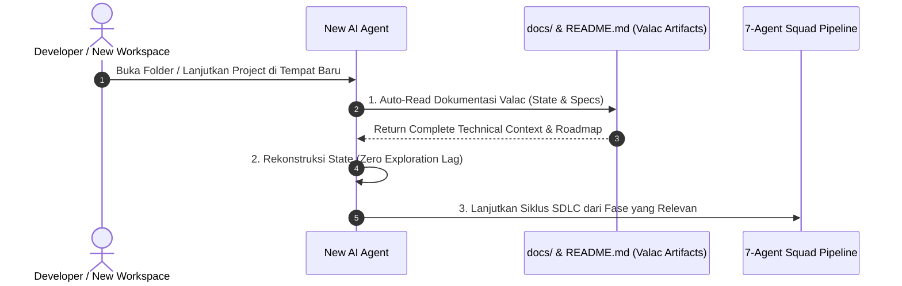
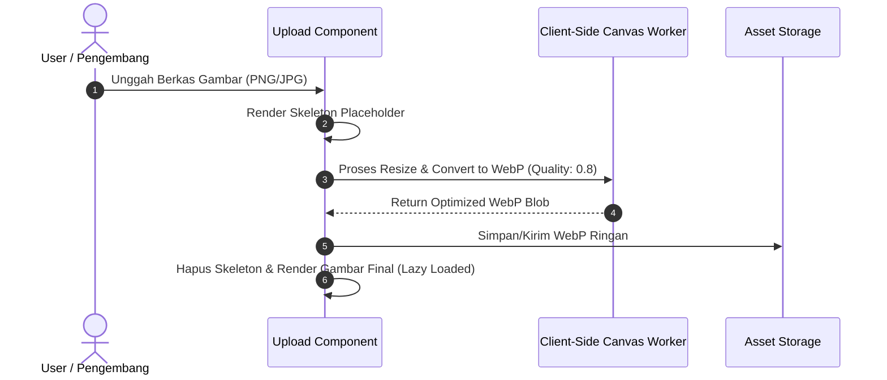

# 📐 Hellix Crew System & Architecture Design

Dokumen ini mendefinisikan rancangan sistem, arsitektur, dan panduan desain untuk proyek **Hellix Crew**.

---

## 1. Visi & Misi Proyek
- **Visi**: *"Don't be evil"* — Membangun sistem yang etis, aman, transparan, dan berorientasi penuh pada nilai positif bagi pengembang dan pengguna.
- **Misi**: *"Turning imagination into reality"* — Menyediakan ekosistem rekayasa perangkat lunak cerdas dan modular yang mentransformasi ide serta imajinasi menjadi produk nyata dengan efisiensi maksimal.

---

## 2. Arsitektur Tingkat Tinggi (High-Level Architecture)



### 2.1 SDLC Lifecycle & AI Handoff Protocol


---

## 3. Komponen Utama
1. **Core Engine**: Mengelola proses eksekusi, pipeline, dan integrasi modul.
2. **Agent & Rules (`AGENTS.md` / `.agents/rules/`)**: Memberikan panduan kontekstual dan batasan aturan bagi asisten cerdas.
3. **Skills (`.agents/skills/`)**: Kumpulan prosedur dan workflow modular:
   - **Optimization**: Context Compaction, Memory Retention, Output Efficiency, AI System Optimization.
   - **Media & UI**: Media Optimization (WebP Canvas & Tailwind Skeleton).
   - **Modern App Architecture**: Resilient API Data Fetching (SWR/Retry), Reactive Real-Time Streaming (SSE/WebSocket), Modern Form Validation, dan PWA Offline Storage (IndexedDB).
4. **Token & Memory Optimization Engine**:
   - **Context Compactor & Pruner**: Memadatkan riwayat percakapan dan membuang konteks irelevan.
   - **Memory Manager (Sliding Window & RAG)**: Mengelola retensi memori aktif dan pencarian vektor on-demand.
   - **Output Efficiency Controller**: Mengatur keringkasan (conciseness) dan batas budget token output.
   - **Architecture Optimizer**: Optimalisasi tokenisasi tingkat lanjut dan pemanfaatan KV-Caching.
5. **Media & Performance Pipeline**:
   - **Client-Side WebP Compression**: Mengompresi gambar yang diunggah langsung ke WebP ringan via Canvas API & OffscreenCanvas.
   - **Skeleton UI & Preload Pipeline**: Transisi skeleton non-blocking & strategi preload aset krusial.
   - **Lightweight Cost Script**: Estimasi dan pelacakan biaya token/komputasi secara efisien dan real-time.
6. **Data & Network Layer**:
   - **Resilient API Fetcher**: Auto-retry exponential backoff & SWR in-memory caching.
   - **Real-Time Streaming Engine**: SSE parser untuk AI token response & reconnecting WebSocket.
   - **Offline-First PWA Store**: Persistence data lokal terstruktur menggunakan IndexedDB.
7. **Configuration & Data**: Manajemen konfigurasi proyek (`.env`) dan persistensi data.

---

## 4. Workflow Media & UI Performance

### 4.1 Upload & Kompresi Gambar ke WebP (Lightweight)


### 4.2 Skeleton & Preload Strategy
- **Skeleton State**: Shimmer CSS murni tanpa pustaka eksternal untuk menghindari Cumulative Layout Shift (CLS).
- **Preload Kritis**: Menggunakan `<link rel="preload">` dan `decoding="async"` untuk aset *above-the-fold*.
- **Lazy Loading**: Native `loading="lazy"` untuk semua media di luar viewport awal.

### 4.3 Lightweight Cost Script (Token / Usage Estimator)
- Dijalankan secara asinkron / event-driven dengan kompleksitas $O(1)$.
- Menghitung biaya token (Input vs Output) per jutaan token tanpa membebani thread utama.

---

## 5. Frontend Architecture & UI Guidelines

### 5.1 Base Styling: Tailwind CSS
- Menggunakan pendekatan utility-first dengan **Tailwind CSS**.
- Menyediakan layout responsif (Mobile $\rightarrow$ Desktop), dark mode support, dan composable UI utility classes.
- Menghindari styling CSS inline ad-hoc yang tidak konsisten.

### 5.2 Iconography (No Raw Emojis)
- Semua simbol UI, indikator aksi, dan status dilarang menggunakan karakter emotikon/emoji teks mentah.
- Standar icon:
  - **Inline SVG**: Ringan, scalable, dapat di-style langsung via class Tailwind (`w-5 h-5 text-indigo-500 fill-current`).
  - **FontAwesome Icons / SVG**: Digunakan secara konsisten untuk aksi sistem (misalnya `fa-solid fa-cloud-arrow-up`, `fa-solid fa-bolt`, `fa-solid fa-calculator`).

### 5.3 Tailwind Skeleton Shimmer
Implementasi skeleton menggunakan utility Tailwind CSS:
```html
<!-- Contoh Skeleton Card dengan Tailwind CSS -->
<div class="animate-pulse flex space-x-4 p-4 bg-slate-800 rounded-xl border border-slate-700">
  <div class="rounded-lg bg-slate-700 h-16 w-16"></div>
  <div class="flex-1 space-y-3 py-1">
    <div class="h-4 bg-slate-700 rounded w-3/4"></div>
    <div class="space-y-2">
      <div class="h-3 bg-slate-700 rounded"></div>
      <div class="h-3 bg-slate-700 rounded w-5/6"></div>
    </div>
  </div>
</div>
```

### 5.4 Logo & Branding Asset
- Logo utama aplikasi selalu mengacu pada `public/logo.png` atau path yang diatur melalui environment variable (misalnya `APP_LOGO_PATH` / `VITE_APP_LOGO_PATH`).
- Komponen logo harus mendukung fallback yang rapi dan optimasi dimensi.

### 5.5 UI Interaction & Routing Guidelines (No Modals for CRUD)
- **Hindari Modal Popup**: Dilarang menggunakan modal dialog untuk flow form CRUD atau menampilkan data/informasi yang banyak dan kompleks.
- **Dedicated Page / View**: Setiap tampilan detail, form tambah/edit, atau inspeksi item harus menggunakan halaman/view khusus.
- **Slug-Based Routing**: Gunakan URL parameter berbasis **slug** yang SEO-friendly dan shareable (contoh: `/modules/:slug`, `/projects/:slug`, `/details/:slug`) alih-alih modal overlay.

### 5.6 Flat Minimalist Layout & Clean Data Representation
- **Anti-Card Bertumpuk (*Zero Nested Clutter*)**: Dilarang menggunakan desain dengan kartu yang bertumpuk-tumpuk, bayangan berlebihan (*heavy drop-shadows*), atau container di dalam container yang membingungkan mata.
- **Flat Surface Aesthetic**: Gunakan permukaan datar yang elegan dengan latar belakang bersih (`bg-white` / `bg-slate-50`), garis pemisah tipis (*subtle 1px border* `border-slate-200`), dan tipografi tajam.
- **Lapang & Ergonomis**: Maksimalkan whitespace (*padding & gap* teratur) sehingga konten data, metrik, dan tombol aksi terasa lapang, terstruktur rapi, dan tidak sesak (*breathable interface*).

### 5.7 Non-Intrusive Notification & Toast System
- **Pengganti Alert/Modal Dialog**: Gunakan **Floating Toast Notifications** (Tailwind CSS + SVG Icons) di sudut layar untuk umpan balik status aksi CRUD (sukses, peringatan, error) dengan durasi auto-dismiss.

### 5.8 Client-Side State & Cache Query Strategy (SWR Pattern)
- Menerapkan caching data sisi client (*stale-while-revalidate*) untuk memastikan transisi antar rute slug instan (*optimistic updates*) tanpa memicu re-fetch berlebihan.

---

## 6. Environment Configuration & System Info
- Berkas `.env` (template tersedia pada `.env.example`) adalah **Single Source of Truth** untuk seluruh informasi penting terkait sistem yang dibangun (konfigurasi endpoint, secret, setting model, flag fitur, dan path aset).
- Konfigurasi diparsing secara aman melalui modul konfigurasi terpusat.

---

## 7. Prinsip Desain
- **Modular & Extensible**: Setiap fitur dibangun sebagai modul independen yang mudah diperluas.
- **Zero-Bloat & Lightweight**: Mengutamakan native Web APIs (Canvas) dan Tailwind CSS purge/minify tanpa dependensi runtime berat.
- **Consistent & Professional UI**: Menggunakan Tailwind CSS, `logo.png`, dan SVG/FontAwesome icons untuk seluruh visual antarmuka.
- **Centralized Configuration**: Memastikan seluruh informasi sistem bersumber dari environment variables.
- **Progressive Enhancement**: Fitur dapat ditambahkan bertahap tanpa merusak fondasi yang ada.
- **Maintainability**: Penulisan kode dan dokumentasi selalu terintegrasi dan konsisten.
