<div align="center">

  

  # ⚡ HELLIX CREW
  
  **Next-Generation Multi-Agent Autonomous SDLC Architecture**

  [](file:///c:/still%20dev/zencode/docs/project-notes/SYSTEM_STATE.md)
  [](file:///c:/still%20dev/zencode/AGENTS.md)
  [](file:///c:/still%20dev/zencode/DESIGN.md)
  [](LICENSE)

  <br/>

  > 🌐 **Visi**: *"Don't be evil"*  
  > 🎯 **Misi**: *"Turning imagination into reality"*

  <br/>

  <p align="center">
    <a href="#-ringkasan-proyek"><b>Eksplorasi Fitur</b></a> •
    <a href="#-7-agent-squad-workflow"><b>Alur Squad</b></a> •
    <a href="#-arsitektur--struktur-repositori"><b>Struktur Modul</b></a> •
    <a href="#-standar-desain--antarmuka"><b>Design System</b></a> •
    <a href="#-protokol-ai-handoff-zero-friction"><b>AI Onboarding</b></a>
  </p>

</div>

---

## 📖 Ringkasan Proyek

**Hellix Crew** adalah kerangka kerja (*framework*) dan *starter kit* pengembangan modular canggih yang digerakkan oleh **7-Agent Autonomous Squad**. Proyek ini menerapkan rekayasa perangkat lunak presisi tinggi dengan pemisahan tugas ketat (*strict separation of concerns*), eliminasi halusinasi, perlindungan keamanan otomatis (*security gate*), dan dokumentasi *real-time* berbasis single source of truth.

---

## 👥 7-Agent Squad Workflow

Pengembangan dijalankan secara sekuensial dan terisolasi tanpa tumpang tindih tanggung jawab:

```mermaid
graph LR
    subgraph Planning ["🛫 FASE 1: PERENCANAAN"]
        A["<b>1. Faust</b><br/><i>Code Architect</i><br/>Blueprint & Screen Profile"]
    end

    subgraph Core ["🛠️ FASE 2-3: PEMBANGUNAN"]
        B["<b>2. Mephisto</b><br/><i>Backend Writer</i><br/>API & Database Layer"]
        C["<b>3. Lilith</b><br/><i>Frontend Writer</i><br/>Tailwind UI & Slug Pages"]
    end

    subgraph Quality ["🔍 FASE 4-5: KUALITAS & KEAMANAN"]
        D["<b>4. Malphas</b><br/><i>Bug Finder</i><br/>Security & Dependency Audit"]
        E["<b>5. Belial</b><br/><i>TestCraft</i><br/>Zero-Mock Test Suites"]
    end

    subgraph Execution ["⚡ FASE 6-7: RUNTIME & DOKUMENTASI"]
        F["<b>6. Baal</b><br/><i>Terminal Executor</i><br/>CLI Commands & Dev Server"]
        G["<b>7. Valac</b><br/><i>DocuMint</i><br/>Knowledge Base & State Sync"]
    end

    A --> B
    B --> C
    C --> D
    D --> E
    E --> F
    F --> G

    style Planning fill:#f0fdf4,stroke:#22c55e,stroke-width:2px;
    style Core fill:#eff6ff,stroke:#3b82f6,stroke-width:2px;
    style Quality fill:#fef2f2,stroke:#ef4444,stroke-width:2px;
    style Execution fill:#faf5ff,stroke:#a855f7,stroke-width:2px;
```



### 📋 Matriks Peran & Tanggung Jawab

| Fase | Agent | Spesialisasi | Output & Tanggung Jawab Inti | Log Kunci |
|:---:|---|---|---|---|
| **1** | **Faust** | Code Architect | Blueprint arsitektur, Profiling layar target, Mock API Contract | `[Faust] 📜 Blueprint & Device Profile selesai.` |
| **2** | **Mephisto** | Backend Writer | Server API, skema basis data, autentikasi, & logika murni | `[Mephisto] 🎛️ Server & database aktif.` |
| **3** | **Lilith** | Frontend Writer | Antarmuka Tailwind CSS, Light Mode Office, Flat Slug Pages | `[Lilith] 🎨 UI selesai dibangun dan terhubung.` |
| **4** | **Malphas** | Bug Finder | Security linting, Audit CVE dependensi, Proteksi Merge Conflict | `[Malphas] 👁️ Kode statis & dependensi aman.` |
| **5** | **Belial** | TestCraft | Automated Unit & Integration Tests (Zero-Mock pure functions) | `[Belial] ⛓️ Skrip Unit & Integration Test dikunci.` |
| **6** | **Baal** | Terminal Executor | Satu-satunya eksekutor CLI: install dependensi, runner, dev server | `[Baal] 🚀 Perintah terminal sukses.` |
| **7** | **Valac** | DocuMint | Arsip dokumentasi proyek (`docs/`), sinkronisasi `SYSTEM_STATE.md` & `README.md` | `[Valac] ✍️ Riwayat sistem terdokumentasi.` |

---

## 📂 Arsitektur & Struktur Repositori

```text
zencode/
├── .agents/
│   ├── plugins/                  # 🌟 7 Plugin Agen Mandiri & Terisolasi
│   │   ├── faust/                # Architect Plugin
│   │   ├── mephisto/             # Core Backend Plugin
│   │   ├── lilith/               # UI Engineering Plugin
│   │   ├── malphas/              # Security Linting Plugin
│   │   ├── belial/               # Automated Testing Plugin
│   │   ├── baal/                 # Runtime & Terminal Plugin
│   │   └── valac/                # Documentation & Archivery Plugin
│   └── skills/                   # 🧠 Modul Kognitif & Optimasi AI
│       ├── ai-systems-optimization/     # BPE Tokenization & KV Cache
│       ├── forms-and-client-validation/ # Real-time Validation Schema
│       ├── media-optimization-workflow/ # Offscreen WebP & Skeleton UI
│       ├── modern-api-data-fetching/    # SWR Cache & Exponential Backoff
│       ├── pwa-offline-storage/         # Service Worker & IndexedDB
│       └── reactive-realtime-streaming/ # SSE & WebSocket Token Stream
├── docs/                         # 📚 Knowledge Base & Dokumentasi Teknis
│   ├── project-notes/
│   │   ├── DEVELOPMENT_HISTORY.md
│   │   └── SYSTEM_STATE.md       # Status SDLC Terkini & AI Handoff
├── AGENTS.md                     # 📜 Konstitusi & Peraturan Squad
├── DESIGN.md                     # 📐 Spesifikasi Cetak Biru Sistem
├── .env.example                  # 🔐 Single Source of Truth Konfigurasi
└── README.md                     # ⚡ Berkas Utama Repositori
```

---

## 🎨 Standar Desain & Antarmuka

| Kriteria | Standar Hellix Crew |
|---|---|
| **Styling Foundation** | **Tailwind CSS** (Utility-First, scalable & ultra-performant) |
| **Visual Ergonomics** | **Light Mode Office** — Palet warna bersih, kontras seimbang, mengurangi kelelahan visual |
| **Layout Philosophy** | **Flat Minimalist (Anti-Card Bertumpuk)** — Pembagian area berbasis border tipis & whitespace proporsional |
| **Navigation & CRUD** | **Slug-Based Dedicated Pages** (`/items/:slug`) — Menghindari penggunaan modal popup untuk data kompleks |
| **Iconography** | **Inline SVG & FontAwesome SVG** — Dilarang keras menggunakan teks emoji mentah pada UI |
| **Branding Identity** | Aset `logo.png` terpusat melalui environment variable / `public/` |

---

## 🔄 Protokol AI Handoff (Zero-Friction Context Reload)

Ketika proyek ini dibuka oleh instansiasi agen AI baru:
1. **Prioritas Baca Pertama**: Periksa [docs/project-notes/SYSTEM_STATE.md](file:///c:/still%20dev/zencode/docs/project-notes/SYSTEM_STATE.md), [AGENTS.md](file:///c:/still%20dev/zencode/AGENTS.md), dan [DESIGN.md](file:///c:/still%20dev/zencode/DESIGN.md).
2. **Rekonstruksi Status Instan**: Pahami fase SDLC yang sedang aktif tanpa perlu menginspeksi seluruh repositori dari awal.
3. **Eksekusi Sekuensial**: Lanjutkan tugas sesuai fase agen yang bertanggung jawab.

---

<div align="center">
  <sub>Built with precision by <b>Hellix Crew</b>. Turning imagination into reality.</sub>
</div>
