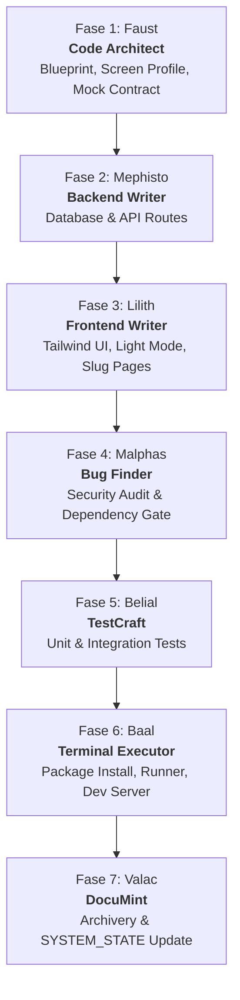

<p align="center">
  
</p>

# 🚀 Hellix Crew

> **Visi**: *"Don't be evil"*  
> **Misi**: *"Turning imagination into reality"*

---

## 📖 Ringkasan Proyek

**Hellix Crew** adalah framework dan starter arsitektur pengembangan berbasis **7-Agent Autonomous Squad**. Proyek ini dirancang untuk alur kerja SDLC terstruktur, mulai dari cetak biru arsitektur, backend logic, antarmuka Tailwind UI modern, audit keamanan, pengujian otomatis *zero-mock*, hingga eksekusi runtime dan dokumentasi otomatis.

---

## 👥 7-Agent Squad Workflow

Pengembangan berjalan sekuensial melalui 7 fase spesifik:



### 📋 Daftar & Peran Agent

| Agent | Peran | Sektor & Tanggung Jawab Utama |
|---|---|---|
| **1. Faust** | Code Architect | Menganalisis kebutuhan, profiling resolusi layar/density, membuat cetak biru arsitektur & *mock API contract*. |
| **2. Mephisto** | Backend Writer | Membangun rute API, database schema, autentikasi, dan logika bisnis murni tanpa menyentuh UI. |
| **3. Lilith** | Frontend Writer | Membangun antarmuka pengguna berbasis Tailwind CSS (Light Mode Office, Card/Grid View, Slug-based routing tanpa modal CRUD). |
| **4. Malphas** | Bug Finder | Security linting, pemindaian vulnerabilitas (CVE check), deteksi secret hardcoded, dan validasi dependensi. |
| **5. Belial** | TestCraft | Menulis skrip Automated Unit & Integration Tests (*Zero-mock* untuk pure function dan kalkulasi kritis). |
| **6. Baal** | Terminal Executor | Satu-satunya agent yang berhak menjalankan terminal commands (install npm, run tests, start dev server). |
| **7. Valac** | DocuMint | Mendokumentasikan status SDLC di folder `docs/`, memperbarui `SYSTEM_STATE.md`, serta memperbarui `README.md`. |

---

## 📂 Struktur Repositori

```text
zencode/
├── .agents/
│   ├── plugins/                  # 7 Plugin Agen Mandiri
│   │   ├── faust/                # Skill & konfigurasi Faust
│   │   ├── mephisto/             # Skill & konfigurasi Mephisto
│   │   ├── lilith/               # Skill & konfigurasi Lilith
│   │   ├── malphas/              # Skill & konfigurasi Malphas
│   │   ├── belial/               # Skill & konfigurasi Belial
│   │   ├── baal/                 # Skill & konfigurasi Baal
│   │   └── valac/                # Skill & konfigurasi Valac
│   └── skills/                   # Koleksi modul arsitektur terintegrasi
│       ├── ai-systems-optimization/
│       ├── forms-and-client-validation/
│       ├── media-optimization-workflow/
│       ├── modern-api-data-fetching/
│       └── ...
├── docs/
│   └── project-notes/
│       └── SYSTEM_STATE.md       # Status SDLC real-time & panduan AI handoff
├── AGENTS.md                     # Pedoman global & protokol 7-Agent squad
├── DESIGN.md                     # Spesifikasi teknis & blueprint arsitektur
├── .env.example                  # Template konfigurasi environment
└── README.md                     # Dokumentasi utama proyek
```

---

## 🎨 Standar Desain & Antarmuka (UI Guidelines)

- **Framework**: Tailwind CSS.
- **Theme**: *Light Mode Office Ergonomics* yang bersih, nyaman, dan minimalis.
- **Anti-Card Bertumpuk**: Desain flat dengan subtle borders & pembagian whitespace yang lapang alih-alih nested cards bertumpuk.
- **No Modals for CRUD**: Menggunakan halaman khusus dan **Slug-based routing** (contoh: `/items/:slug`).
- **Iconography**: Dilarang menggunakan emoji teks pada UI; gunakan **Inline SVG** atau **FontAwesome**.
- **Branding**: Logo utama menggunakan `logo.png` dari folder `public/` atau environment variable.

---

## 🔄 Protokol AI Handoff (Zero-Friction Context Reload)

Jika repositori ini dibuka di lingkungan/mesin baru oleh agent AI:
1. **Baca Pertama**: File [docs/project-notes/SYSTEM_STATE.md](file:///c:/still%20dev/zencode/docs/project-notes/SYSTEM_STATE.md), [AGENTS.md](file:///c:/still%20dev/zencode/AGENTS.md), dan [DESIGN.md](file:///c:/still%20dev/zencode/DESIGN.md).
2. **Konteks Instan**: Rekonstruksi posisi siklus SDLC terakhir dari catatan Valac tanpa perlu membaca ulang seluruh file dari nol.
3. **Lanjutkan Eksekusi**: Teruskan ke fase berikutnya sesuai urutan squad.
