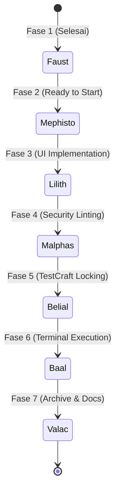

# 📚 Hellix Crew Project Documentation & System State
> *Diproduksi secara otomatis oleh **Valac (DocuMint)** sebagai single source of truth riwayat sistem untuk AI Handoff & Developer Onboarding.*

---

## 📌 Metadata Proyek
- **Nama Proyek**: Hellix Crew
- **Visi**: *"Don't be evil"*
- **Misi**: *"Turning imagination into reality"*
- **Status SDLC Saat Ini**: `Fase 1 (Planning & System Architecture Completed)`
- **Versi**: `1.0.0-alpha`
- **Frontend Stack**: Tailwind CSS (Utility-First), Light Mode (Office Ergonomics), Inline SVG / FontAwesome Icons, Slug-based routing (No Modals for CRUD), Responsive Card/Grid View.
- **Backend & Logic**: Universal API Client with Retry & SWR In-Memory Caching, OffscreenCanvas WebP Compression, $O(1)$ Token Cost Calculator.
- **Konfigurasi Utama**: [`.env.example`](file:///c:/still%20dev/zencode/.env.example)

---

## 👥 7-Agent Squad State & Responsibility Map

---

## 📂 Struktur Arsip & Dokumentasi
1. [AGENTS.md](file:///c:/still%20dev/zencode/AGENTS.md) — Aturan baku sistem, protokol handoff AI, dan pembagian tugas 7 agent.
2. [DESIGN.md](file:///c:/still%20dev/zencode/DESIGN.md) — Dokumen spesifikasi arsitektur teknis lengkap dan alur SDLC.
3. [`.env.example`](file:///c:/still%20dev/zencode/.env.example) — Template konfigurasi environment.
4. `.agents/plugins/` — 7 Entitas Agent Independen & Terisolasi:
   - `faust/` — `faust-architecture-blueprint` (Blueprint & Mock API)
   - `mephisto/` — `mephisto-core-backend` (Backend logic & Database)
   - `lilith/` — `lilith-ui-engineering` (Tailwind UI, Light Mode, Slug Pages)
   - `malphas/` — `malphas-security-linting` (Security Audit & Merge Conflict)
   - `belial/` — `belial-automated-testing` (Unit & Integration TestCraft)
   - `baal/` — `baal-environment-runtime` (Terminal Execution & Dev Server)
   - `valac/` — `valac-documentation-archivery` (Project Documentation & Changelog)
5. `.agents/skills/` — Koleksi skill arsitektur pendukung (Token Optimization, Media WebP, API Client, SSE Streaming, PWA, Validasi Form).

---

## 🎯 Instruksi AI Baru (Onboarding Handoff)
Jika folder ini dibuka di environment baru:
1. Baca file ini ([`docs/project-notes/SYSTEM_STATE.md`](file:///c:/still%20dev/zencode/docs/project-notes/SYSTEM_STATE.md)).
2. Lanjutkan pengerjaan ke **Fase 2 (Mephisto)** atau **Fase 3 (Lilith)** sesuai arahan developer.
